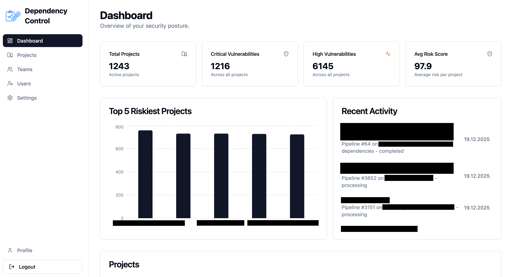
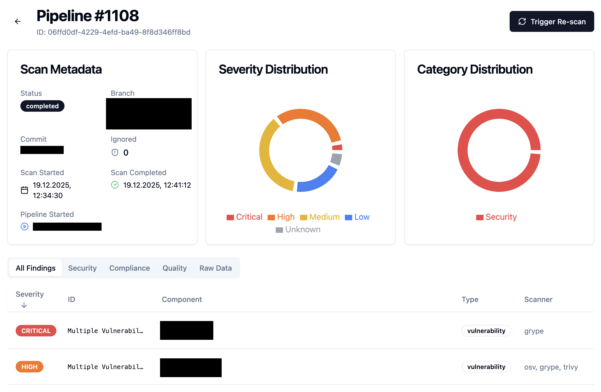
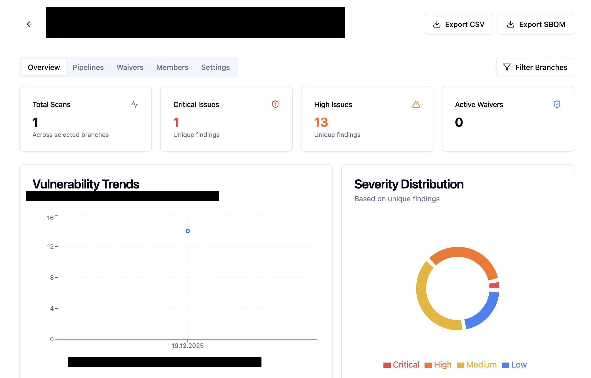

# Dependency Control

**Dependency Control** is a centralized security and compliance platform for managing software supply chain risks. It aggregates SBOMs, secret scans, SAST, and IaC analysis to provide a unified view of your project's security posture.

[](https://sonarcloud.io/summary/new_code?id=morzan1001_Dependency-Control)
[](https://sonarcloud.io/summary/new_code?id=morzan1001_Dependency-Control)
[](https://sonarcloud.io/summary/new_code?id=morzan1001_Dependency-Control)
[](https://sonarcloud.io/summary/new_code?id=morzan1001_Dependency-Control)



## ✨ Features

| Category | Capabilities |
|----------|-------------|
| **Security Analysis** | Vulnerability scanning (Trivy, Grype, OSV), Secret detection, SAST, Malware & Typosquatting detection |
| **Compliance** | License compliance checking, End-of-Life monitoring, Policy enforcement with waivers |
| **Management** | Project & Team management, Role-based access control, 2FA authentication |
| **Integrations** | GitLab CI/CD (OIDC), GitHub Actions (OIDC), Webhooks, Email/Slack/Mattermost notifications |
| **Visibility** | Risk scoring, Trend analysis, SBOM inventory, Centralized dashboard |

<p align="center">
  
  
</p>

## 🔍 Supported Scanners

Dependency Control integrates with leading open-source security tools to provide comprehensive coverage.

### CI/CD Scanners (Ingestion)
These tools run in your pipeline and send data to Dependency Control:
*   **[Syft](https://github.com/anchore/syft)** - Generates Software Bill of Materials (SBOM) from container images and filesystems.
*   **[TruffleHog](https://github.com/trufflesecurity/trufflehog)** - Scans for leaked credentials and secrets in your codebase.
*   **[OpenGrep](https://github.com/opengrep/opengrep)** - Fast and lightweight Static Application Security Testing (SAST).
*   **[Bearer](https://github.com/bearer/bearer)** - Code security scanning focusing on sensitive data flows and privacy.
*   **[KICS](https://github.com/Checkmarx/kics)** - Finds security vulnerabilities, compliance issues, and infrastructure misconfigurations in IaC.

### SBOM Analysis (Internal)
Once an SBOM is ingested, the backend performs deep analysis using:
*   **[Trivy](https://github.com/aquasecurity/trivy)** & **[Grype](https://github.com/anchore/grype)** - Vulnerability scanning against the SBOM.
*   **[OSV.dev](https://osv.dev)** - Distributed vulnerability database.
*   **[Deps.dev](https://deps.dev)** - Insights on dependency health and security.
*   **End-of-Life** - Checks for software components that have reached their end of life.
*   **Malware Detection** - Checks packages against known open-source malware databases.
*   **Typosquatting** - Detects potential typosquatting attacks in dependency names.
*   **License Compliance** - Analyzes licenses for compliance and risk.

## 🛠️ Quick Start (Docker Compose)

The easiest way to run Dependency Control locally.

### 1. Configure Hosts
Add the following to your `/etc/hosts` file to route traffic correctly via Traefik:
```
127.0.0.1 dependencycontrol.local api.dependencycontrol.local metabase.local
```

### 2. Start the Stack
```bash
docker compose up -d --build
```

### 3. Access Services
*   **Frontend Dashboard:** [https://dependencycontrol.local](https://dependencycontrol.local)
*   **Backend API Docs:** [https://api.dependencycontrol.local/docs](https://api.dependencycontrol.local/docs)
*   **Metabase (Analytics):** [https://metabase.local](https://metabase.local)

*Note: Accept the self-signed certificate warning in your browser.*

## 📦 CI/CD Integration

Dependency Control is designed to sit in your CI/CD pipeline.

### GitLab CI (OIDC)
Enable **GitLab Integration** in the System Settings, then use the `CI_JOB_TOKEN` to authenticate. No manual API Key management required!

```yaml
dependency-scan:
  script:
    - |
      curl -X POST "https://api.dependencycontrol.local/api/v1/ingest" \
        -H "Content-Type: application/json" \
        -H "JOB-TOKEN: $CI_JOB_TOKEN" \
        -d @payload.json
```

### GitHub Actions (OIDC)
Enable **GitHub Integration** in the System Settings, then use the `ACTIONS_ID_TOKEN_REQUEST_TOKEN` to authenticate. No manual API Key management required!

```yaml
- name: Dependency Scan
  env:
    ACTIONS_ID_TOKEN_REQUEST_URL: ${{ env.ACTIONS_ID_TOKEN_REQUEST_URL }}
    ACTIONS_ID_TOKEN_REQUEST_TOKEN: ${{ env.ACTIONS_ID_TOKEN_REQUEST_TOKEN }}
  run: |
    OIDC_TOKEN=$(curl -s -H "Authorization: Bearer $ACTIONS_ID_TOKEN_REQUEST_TOKEN" \
      "$ACTIONS_ID_TOKEN_REQUEST_URL&audience=dependency-control" | jq -r '.value')
    curl -X POST "https://api.dependencycontrol.local/api/v1/ingest" \
      -H "Content-Type: application/json" \
      -H "Authorization: Bearer $OIDC_TOKEN" \
      -d @payload.json
```

> **Note:** The GitHub Actions workflow must have `id-token: write` permission.

### API Key (Other CI Systems)
For other systems (Jenkins, etc.), generate a Project API Key in the dashboard and use the `X-API-Key` header.

```bash
curl -X POST "https://api.dependencycontrol.local/api/v1/ingest" \
  -H "x-api-key: $DEP_CONTROL_API_KEY" \
  ...
```

👉 **See [ci-cd/](ci-cd/) for complete pipeline examples.**

## ☸️ Kubernetes Deployment

A Helm chart is available for production deployments.

```bash
helm upgrade --install dependency-control ./helm/dependency-control \
  --namespace dependency-control --create-namespace \
  --set backend.secrets.secretKey="CHANGE_ME"
```

## 📄 License

MIT License. See [LICENSE](LICENSE) for details.
